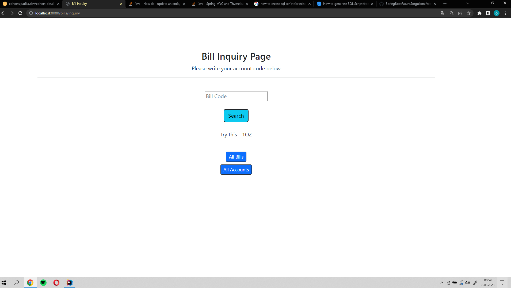
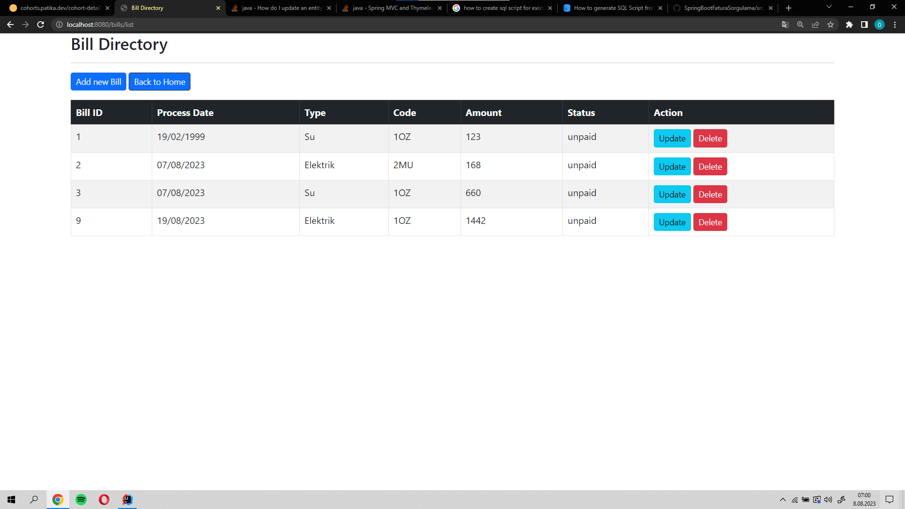
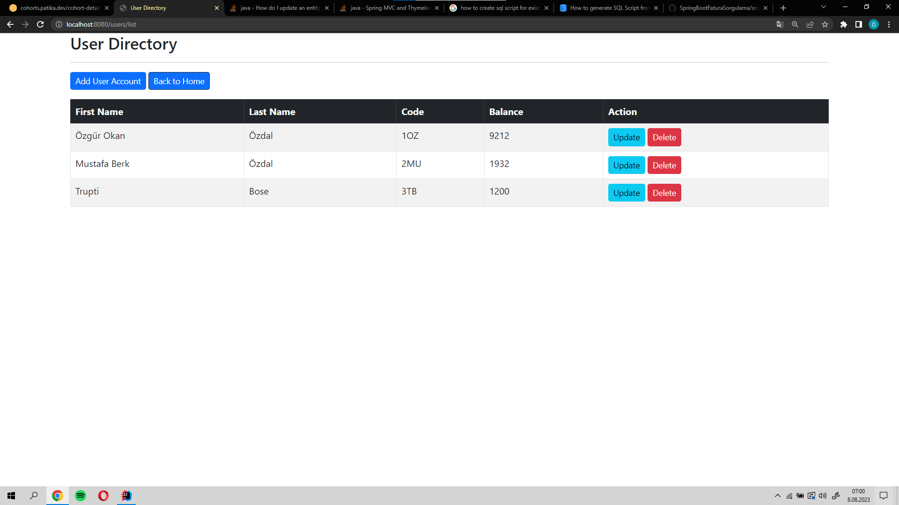
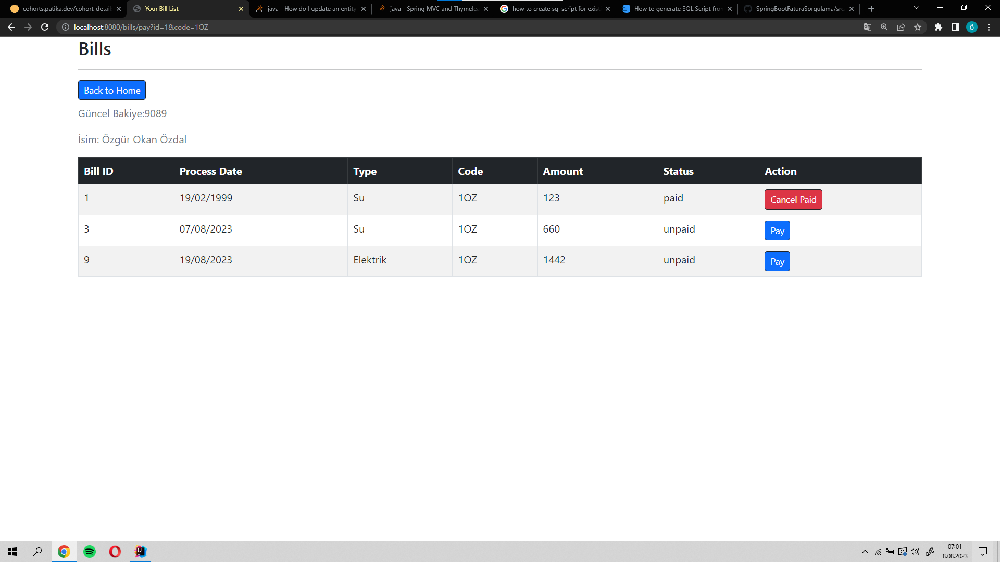

## Spring Boot Fatura Ödeme/Ödeme İptal Uygulaması

- Security ile alakalı bir şey istenmediği için sadece dahil ettim fakat herhangi bir işlem yapmadım
- Ödevde herhangi bir kullanıcı adı parola söylenmediği için onları da dahil etmedim
- Test etmek için sqlScripts klasörü altındaki klasörden scriptleri mySql workbenchde çalıştırıp application.properties dosyasındaki kullanıcı adı ve şifreyi değiştirebilirsiniz.

- 
- 
- 
- 

